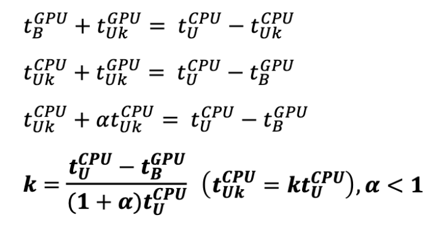
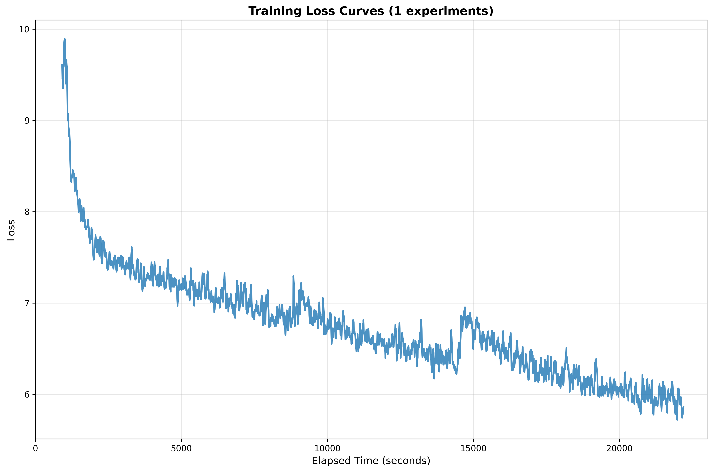
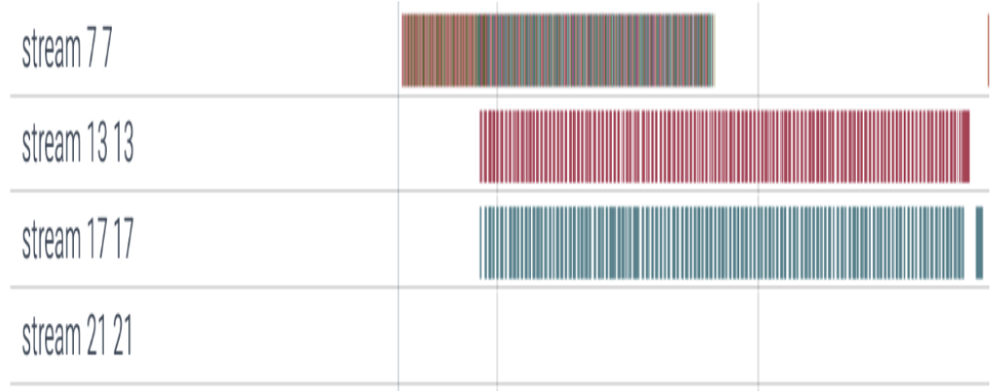
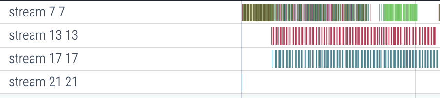

# HyTrainDNN

HyTrainDNN is a heterogeneous training engine designed to efficiently train large-scale deep neural networks (including LLMs) on resource-constrained platforms by leveraging both CPU and GPU memory and compute in parallel.

## 1. Motivation

Training large-scale models, such as a 5B parameter LLaMA2, is both compute- and memory-intensive. For instance, training at full precision (FP32) using the Adam optimizer requires:

- **Model Weights**: 5B × 4 bytes = 20 GB VRAM
- **Optimizer States** (momentum, variance): 5B × 2 × 4 bytes = 40 GB VRAM
- **Non Model data**: ~20-30 GB VRAM

Model weights and optimizer states already exceeds the VRAM capacity of most GPUs, even before accounting for activations (non-model data) and gradients generated during backpropagation. As a result, training such models remains prohibitively expensive and memory-bound.

## 2. Overview of HyTrainDNN

HyTrainDNN addresses this bottleneck through a hybrid CPU–GPU training architecture, where:

- The **master copy** of model weights and optimizer states are stored on the **CPU** (FP32).
- The **training copy** of model weights resides on the **GPU**, utilizing Automatic Mixed Precision (AMP) and a gradient scaler (via PyTorch).
- **Forward (FWD)** and **Backward (BWD)** passes are executed on the GPU with AMP.
- **Parameter Updates (PU)** occur on the CPU in parallel with GPU computations (BWD).

As soon as the gradients for layer N are computed, they are sent to:
- Layer (N–1) on the GPU for further backpropagation, and
- The CPU for updating the master copy using DeepSpeed's CPU Adam (C++/OpenMP-based dense optimizer).

## 3. The CPU Bottleneck

While CPU offloading drastically reduces GPU memory usage, CPU-side parameter updates are slower, leading to GPU idle time between iterations as GPUs wait for updated weights from the CPU.

## 4. Adaptive GPU-CPU Parameter Update Split

To mitigate this, HyTrainDNN adaptively splits parameter updates between the CPU and GPU based on runtime performance using a mathematical formulation that determines **k**, the optimal fraction of layers to update on the GPU.

The key idea is to balance:
- The time taken for GPU backward computation + Time to update k-fraction layers on GPU
- The time for parameter updates on both CPU - Time to update k-fraction layers on CPU.

Formally, the balance condition is derived below:



Since `t_update_GPU < t_update_CPU`, we define

```
α = t_update_GPU / t_update_CPU (<1)
```

where **α** (empirically measured) indicates the GPU–CPU performance ratio.

All terms are estimated at runtime, and the split ratio (k) is recomputed just-in-time (JIT) each iteration—or periodically, as configured.

## 5. Experimental Results

Experiments were conducted on:

- **GPU**: NVIDIA A100 (80 GB HBM)
- **CPU**: AMD EPYC (HPC cluster)
- **Model & Batch Size**: LLaMA2-10B with BS = 8.
- **Training Throughput**: ~23 TF/s
- **Hyperparameters**: α = 0.083, k = 0.1-0.2 (estimated dynamically)

### Loss Convergence

Dynamic parameter splitting and CPU–GPU transfers of HyTrainDNN preserves stable loss convergence. The experiment below was perfomed for 3000 training iterations.



## 6. GPU Activity Trace

The figure below shows GPU activity (only) visualized using [VizTracer](https://github.com/gaogaotiantian/viztracer).

- **Stream 7**: Forward and backward GPU kernels
- **Streams 13 & 17**: Device -> Host (gradients) & Host -> Device (updated parameters) data transfers.

| Before | After |
|--------|-------|
|  |  |
| This image shows base parallelism between BWD and Updates (CPU only) | This image shows BWD & Updates in parallel along with GPU updates (in green) to reduce GPU idling.|


## 7. Key Features

Hybrid CPU–GPU memory utilization for scalable model training  
Parallel parameter updates overlapping with GPU compute  
Adaptive runtime scheduling for optimal CPU/GPU utilization  
Maintains convergence while improving throughput  

## 8. Implementation Notes

- **Optimizer on CPU**: DeepSpeed CPU Adam (dense, multithreaded)
- **Optimizer on GPU**: Torch Adam
- **Precision**: FP32 master copy (CPU), Mixed Precision (GPU)
- Parameter split computed via runtime performance metrics

## 9. References and Contact

**Base Framework**: CoTrain (ICPP '23)

**Contact**:  
Karthik Namboori  (namkarthik2003@gmail.com)

For collaborations, feature requests, or bug reports, please reach out.
